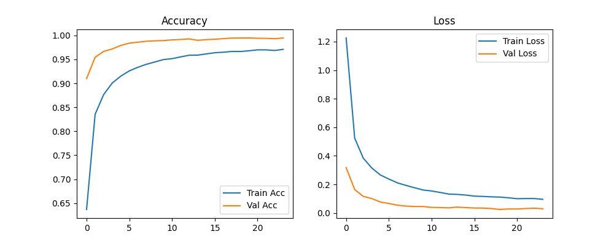
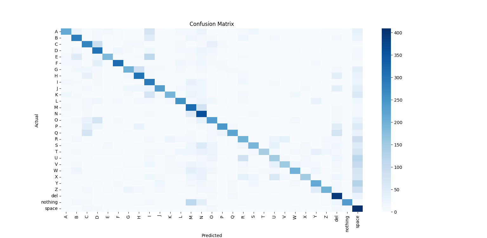

# 🤟 Real-Time Sign Language Translation System

An AI-powered **Sign Language Translator** that recognizes ASL hand gestures from a webcam and converts them into **text** and **speech** in real time. Built using **MediaPipe** hand localization, **MobileNetV2** transfer learning, and **temporal smoothing** — achieving **95.3% top-1 accuracy** on a 36-class dataset without GPU acceleration.

The app **automatically detects its environment** at startup — no configuration needed. Run locally and it uses OpenCV + pyttsx3. Deploy to Hugging Face or Render and it uses WebRTC + Web Speech API.

---

## 📌 Objectives

- Design a real-time sign language recognition system operable on consumer hardware (CPU-only)
- Integrate MediaPipe-based hand localization with a fine-tuned MobileNetV2 classifier
- Suppress frame-level prediction jitter via sliding-window temporal smoothing
- Display recognized signs as text and optionally convert to speech
- Support both local development and public cloud deployment with live webcam and audio

---

## 📌 Features

- ✅ **Auto-detected webcam mode**: OpenCV (local) or WebRTC (cloud) — zero config
- 🧠 Fine-tuned **MobileNetV2** gesture classifier (TensorFlow / Keras)
- 🪟 Sliding-window **temporal smoothing** (majority-vote, W=10) for stable output
- 🔊 **Auto-detected TTS**: pyttsx3 (local) or Web Speech API (cloud) — zero config
- ☁️ **Environment badge** in UI — `💻 Local · OpenCV` or `☁️ Cloud · WebRTC`
- 🌙 Light / Dark mode toggle
- 🪞 Mirror toggle for front-facing cameras
- 📊 Confidence bar with colour-coded thresholds (green / amber / red)
- 🔄 Delete last character, Reset word, word history tracking

---

## 🧱 System Architecture

The inference pipeline (MediaPipe → ROI → MobileNetV2 → smoothing) is identical in both modes. Only the frame source and audio output differ.

### Local mode (auto-detected)

```
cv2.VideoCapture(CAMERA_INDEX)
    │  BGR frame
    ▼
MediaPipe Hands — 21 landmarks → ROI crop       (~26 ms/frame)
    │
    ▼
Resize 224×224 · ImageNet normalise
→ MobileNetV2 inference (3.4M params)           (~39 ms/frame)
→ Temporal smoothing (W=10)
    │
    ▼
st.image() → displayed in Streamlit left column
Completed word → pyttsx3 → OS audio speakers

Controls: ▶ Start  ⏹ Stop  (below video in left column)
```

### Cloud mode (auto-detected on Render / Hugging Face)

```
User's Browser
    │  webcam captured by browser (permission prompt)
    │  frames sent to server via WebRTC + STUN
    ▼
Server: MediaPipe → ROI → MobileNetV2 → smoothing
    │
    │  annotated frame returned to browser via WebRTC
    ▼
Browser renders video (streamlit-webrtc widget)
Completed word → Web Speech API → browser speaks it
    (server has no camera, no audio hardware involved)
```

### Mode detection flow

```
App starts
    ├─ RENDER=true    → auto by Render      → ☁️ Cloud · WebRTC + Web Speech
    ├─ SPACE_ID set   → auto by HF Spaces   → ☁️ Cloud · WebRTC + Web Speech
    └─ neither        → local machine       → 💻 Local · OpenCV + pyttsx3
```

Total end-to-end inference latency: **~87 ms** (CPU-only) — within the 100 ms interactive threshold.

---

## 🖥️ Running Scenarios

### Scenario 1 — Local machine · OpenCV · pyttsx3

**What runs where:** `cv2.VideoCapture` opens the webcam directly on your machine. MediaPipe and MobileNetV2 run locally. pyttsx3 speaks through your OS audio drivers.

**Nothing to configure.** Just run:

```bash
streamlit run scripts/app.py
```

The UI badge shows **💻 Local · OpenCV**. The left column shows a **▶ Start** / **⏹ Stop** button row below the video area. To use a non-default camera, set `CAMERA_INDEX`:

```bash
# Windows — use Camera 1 (e.g. external USB webcam)
set CAMERA_INDEX=1 && streamlit run scripts/app.py

# macOS / Linux
CAMERA_INDEX=1 streamlit run scripts/app.py
```

---

### Scenario 2 — Hugging Face Spaces · WebRTC · Web Speech API

**What runs where:** Hugging Face automatically injects `SPACE_ID`. The app locks to cloud mode. The user's browser captures the webcam, sends frames to the HF server via WebRTC, the server runs inference, returns annotated frames to the browser. Web Speech API speaks the result in the browser. The server has no camera or audio hardware.

**Configuration before deploying:**

1. Use `requirements.txt` (cloud build — `opencv-python-headless`, `streamlit-webrtc`, no pyttsx3)
2. Add `.streamlit/config.toml`:

```toml
[server]
headless = true
port = 7860
enableCORS = false
enableXsrfProtection = false
```

3. Commit model files directly — model is < 30 MB, within GitHub's 100 MB limit, no LFS needed
4. `SPACE_ID` is injected automatically — no env vars to set manually

**Deploy steps:**

1. [huggingface.co/spaces](https://huggingface.co/spaces) → New Space → SDK: **Streamlit**
2. Connect your GitHub repository
3. Start command: `streamlit run scripts/app.py`

---

### Scenario 3 — Render · WebRTC · Web Speech API

**What runs where:** Identical to Hugging Face. Render injects `RENDER=true` automatically.

**Configuration:**

`.streamlit/config.toml`:

```toml
[server]
headless = true
port = 10000
enableCORS = false
enableXsrfProtection = false
```

**Render web service settings:**

| Field                | Value                                                                       |
| -------------------- | --------------------------------------------------------------------------- |
| Build Command        | `pip install -r requirements.txt`                                           |
| Start Command        | `streamlit run scripts/app.py --server.port 10000 --server.address 0.0.0.0` |
| Environment Variable | `PYTHON_VERSION` = `3.11.0`                                                 |

---

### Scenario summary

| Scenario            | Detected by                 | Camera                           | Audio                    | UI badge          |
| ------------------- | --------------------------- | -------------------------------- | ------------------------ | ----------------- |
| Local machine       | neither env var set         | `cv2.VideoCapture` on machine    | pyttsx3 (OS drivers)     | 💻 Local · OpenCV |
| Hugging Face Spaces | `SPACE_ID` auto-injected    | Browser → WebRTC → HF server     | Web Speech API (browser) | ☁️ Cloud · WebRTC |
| Render              | `RENDER=true` auto-injected | Browser → WebRTC → Render server | Web Speech API (browser) | ☁️ Cloud · WebRTC |

---

## 🔧 Environment Variables Reference

| Variable         | Set by                   | Values                | Effect                                           |
| ---------------- | ------------------------ | --------------------- | ------------------------------------------------ |
| `RENDER`         | Render (automatic)       | `true`                | Forces cloud/WebRTC mode                         |
| `SPACE_ID`       | Hugging Face (automatic) | space name            | Forces cloud/WebRTC mode                         |
| `CAMERA_INDEX`   | You (optional)           | `0` · `1` · `2` · `3` | Camera device index for local mode. Default: `0` |
| `PYTHON_VERSION` | You (Render panel)       | `3.11.0`              | Ensures correct Python on Render                 |

> `RUN_MODE` is no longer a supported variable — mode is determined entirely by platform environment variables.

---

## 📈 Results

### Classification Accuracy

| Method                                   | Accuracy (%) | Smoothing |
| ---------------------------------------- | ------------ | --------- |
| Standard CNN (from scratch)              | 91.2         | No        |
| MobileNetV2 (no smoothing)               | 92.5         | No        |
| EfficientNet-B0 (no smoothing)           | 93.1         | No        |
| **Proposed System (MobileNetV2 + W=10)** | **95.3**     | **Yes**   |

### Macro-Averaged Metrics (36 classes)

| System                     | Precision | Recall    | F1-Score  |
| -------------------------- | --------- | --------- | --------- |
| MobileNetV2 (no smoothing) | 0.928     | 0.921     | 0.917     |
| **Proposed (W=10)**        | **0.951** | **0.948** | **0.942** |

### Inference Latency (CPU-only, n=500 frames)

| Stage                          | Avg. Time (ms) |
| ------------------------------ | -------------- |
| Frame Capture & Conversion     | 8              |
| MediaPipe Hand Detection       | 26             |
| ROI Extraction & Preprocessing | 14             |
| MobileNetV2 Inference          | 39             |
| **Total (End-to-End)**         | **87**         |

### Temporal Smoothing Ablation

| W        | Accuracy (%) | Label Changes / 3s | Stability Gain |
| -------- | ------------ | ------------------ | -------------- |
| 1 (none) | 92.5         | 4.7                | —              |
| 5        | 93.8         | 2.1                | 55.3%          |
| **10**   | **95.3**     | **0.3**            | **93.6%**      |
| 15       | 95.1         | 0.1                | 97.9%          |

Accuracy / Loss Plot:


Confusion Matrix:


---

## 🗂️ Project Structure

```
RTSignLangTranslation/
│
├── data/
│   ├── train/          ← A–Z + del, nothing, space
│   ├── val/
│   └── test/
│
├── models/
│   ├── mobilenet_mp_25%_v2_best.h5
│   └── class_labels_mobilenet_mp_25%_v2.json
│
├── core/                        ← shared pipeline modules
│   ├── __init__.py
│   ├── hand_cropper.py
│   ├── preprocessor.py
│   ├── classifier.py
│   ├── pipeline_config.py
│   ├── dataset.py
│   ├── tts_speaker.py
│   └── word_builder.py
│
├── scripts/
│   ├── app.py                   ← Streamlit web app (v7.0)
│   ├── download_and_prepare_dataset.py
│   ├── crop_existing_dataset_with_mediapipe.py
│   ├── crop_input_image_with_mediapipe.py
│   ├── train_pipelines.py
│   ├── benchmark_pipelines.py
│   ├── predict_single_image.py
│   └── predict_webcam.py
│
├── reports/
│   ├── Figure_2_epochs_accuary_loss_withMediaPipe.png
│   └── Figure_3_confusionmatrix_withMediaPipe.png
│
├── .streamlit/
│   └── config.toml              ← headless=true · port=7860 (HF) or 10000 (Render)
│
├── requirements.txt             ← cloud deployment (headless OpenCV, WebRTC, no pyttsx3)
├── requirements-local.txt       ← local development (full OpenCV, pyttsx3, kaggle tools)
└── README.md
```

---

## ⚙️ Tech Stack

| Category        | Library / Tool                                 |
| --------------- | ---------------------------------------------- |
| Language        | Python 3.11                                    |
| Deep Learning   | TensorFlow 2.15, Keras                         |
| Backbone        | MobileNetV2 (pretrained ImageNet)              |
| Computer Vision | OpenCV, MediaPipe Hands                        |
| Web UI          | Streamlit                                      |
| Webcam — Local  | `cv2.VideoCapture` (direct OS access)          |
| Webcam — Cloud  | `streamlit-webrtc` + `aiortc` (WebRTC)         |
| TTS — Local     | pyttsx3 (OS audio drivers)                     |
| TTS — Cloud     | Web Speech API (browser-native, zero packages) |
| Utilities       | NumPy, scikit-learn, Matplotlib, seaborn       |

---

## 📦 Installation & Setup

### 1️⃣ Clone the Repository

```bash
git clone https://github.com/<your-username>/RTSignLangTranslation.git
cd RTSignLangTranslation
```

### 2️⃣ Create Virtual Environment

```bash
# Single Python version
python -m venv .venv

# Multiple Python versions — use 3.11
py -3.11 -m venv .venv

# Activate — Windows
.\.venv\Scripts\activate

# Activate — macOS / Linux
source .venv/bin/activate

python --version   # confirm 3.11.x
```

### 3️⃣ Install Local Dependencies

```bash
pip install -r requirements-local.txt
```

### 4️⃣ (Optional) Register Jupyter Kernel

```bash
pip install ipykernel
python -m ipykernel install --user --name venv311 --display-name "Python 3.11 (.venv)"
```

---

## 📁 Dataset Setup

36-class combined dataset (~12,000 images): ASL Alphabet (Kaggle, 87k images, 29 classes) + original ISL captures across 7 signers and 4 lighting conditions.

```bash
# Download and organize automatically
python scripts/download_and_prepare_dataset.py

# Preprocess with MediaPipe hand cropping
python scripts/crop_existing_dataset_with_mediapipe.py
```

---

## 🏋️ Model Training

```bash
python scripts/train_pipelines.py
python scripts/benchmark_pipelines.py
```

Training configuration: Adam optimizer · cosine LR decay · batch 32 · 30 epochs · 10-epoch warm-up (backbone frozen) · fine-tune top 2 MobileNetV2 blocks at LR=1e-5 · augmentation: horizontal flip, brightness/contrast ±30%, random occlusion.

---

## 🔍 Local CLI Inference

```bash
# Single image prediction
python scripts/predict_single_image.py --image path/to/image.jpg

# Live webcam (bypasses Streamlit entirely)
python scripts/predict_webcam.py
```

---

## 📦 Requirements Files — What Differs

| Package       | `requirements-local.txt`           | `requirements.txt` (cloud)            |
| ------------- | ---------------------------------- | ------------------------------------- |
| OpenCV        | `opencv-contrib-python` (full GUI) | `opencv-python-headless` (no display) |
| TensorFlow    | `tensorflow` + `tensorflow-intel`  | `tensorflow` only                     |
| WebRTC        | `streamlit-webrtc`, `aiortc`, `av` | same                                  |
| TTS           | `pyttsx3`                          | ❌ removed (Web Speech API used)      |
| Audio         | `sounddevice`                      | ❌ removed                            |
| Dataset tools | `kaggle`, `kagglesdk`              | ❌ removed                            |
| GCS IO        | `tensorflow-io-gcs-filesystem`     | ❌ removed                            |

---

## ⚠️ Limitations

- **Static gestures only** — dynamic two-handed gestures not yet supported
- **ASL-dominant training** — ISL represents ~18% of training data
- **Environmental sensitivity** — MediaPipe detection degrades ~18% under direct sunlight or low light
- **Similar-gesture confusion** — primary error pairs M/N, A/S, E/S account for ~61% of errors
- **Web Speech API voice quality** varies by OS (excellent on Windows/macOS/Android, robotic on some Linux browsers)
- **WebRTC on cloud** requires STUN-reachable network; corporate firewalls may need a TURN server

---

## 🚀 Future Enhancements

- Dynamic gesture support via LSTM / Transformer over temporal MobileNetV2 feature sequences
- ISL corpus expansion through targeted data collection
- Confidence-gated output to suppress low-confidence predictions under adverse conditions
- Multi-angle training to resolve topology-based confusion pairs (M/N, A/S, E/S)
- TURN server support for restrictive network environments
- gTTS as a higher-quality cloud TTS alternative

---

## 🔬 Comparison with Prior Work

| Method                          | Accuracy (%) | GPU Required | Real-Time |
| ------------------------------- | ------------ | ------------ | --------- |
| Starner & Pentland (HMM)        | 91.0         | No           | Yes       |
| Koller et al. (CNN)             | 88.3         | Yes          | No        |
| Bheda & Radpour (MediaPipe+MLP) | 88.7         | No           | Yes       |
| Chuan et al. (MediaPipe+RF)     | 89.7         | No           | Yes       |
| **Proposed System**             | **95.3**     | **No**       | **Yes**   |

---

## 🎓 Use Cases

- **Assistive technology** — real-time communication aid for deaf individuals interacting with non-signing personnel
- **Sign language education** — self-paced learners verify gesture formation without an instructor
- **Touch-free interfaces** — smart-home control, clinical environments, AR/VR gesture navigation

---

## 🧪 Demo

<!-- TODO: Add GIF / video demo link or Hugging Face Space URL here -->

> _Live demo link coming soon._

---

## 🤝 Contributing

Contributions are welcome! Fork the repo and submit a pull request. Please open an issue first for significant changes.

---

## 📜 License

This project is licensed under the **MIT License**. You are free to use, modify, and distribute with attribution.

---

## 🙌 Acknowledgements

- [MediaPipe Hands](https://mediapipe.dev/) — Google's real-time hand landmark detection
- [MobileNetV2](https://arxiv.org/abs/1801.04381) — Sandler et al., efficient depthwise separable CNN
- [ASL Alphabet Dataset](https://www.kaggle.com/datasets/grassknoted/asl-alphabet) — Kaggle community dataset
- [streamlit-webrtc](https://github.com/whitphx/streamlit-webrtc) — WebRTC integration for Streamlit
- [World Health Organization](https://www.who.int/news-room/fact-sheets/detail/deafness-and-hearing-loss) — Deafness and hearing loss statistics

---

## 📄 Citation

```bibtex
@inproceedings{susritha2024realtimeasl,
  title     = {Real-Time Sign Language Translation System Using Deep Learning and Computer Vision},
  author    = {Gudimetla, Susritha and G., Sravani and Mohan, A.},
  booktitle = {<!-- TODO: IEEE conference/journal name -->},
  year      = {<!-- TODO: year -->},
  pages     = {<!-- TODO: pages -->},
  doi       = {<!-- TODO: DOI -->}
}
```

---

## 📬 Contact

**Author:** Susritha Gudimetla
**Email:** gudimetlasusritha@gmail.com
**Institution:** Department of Computer Science and Engineering, Chaitanya Bharathi Institute of Technology, Hyderabad, India
